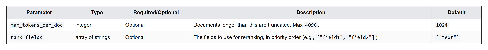
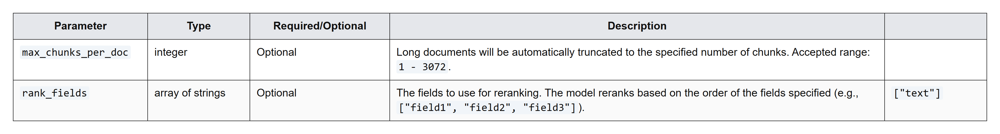
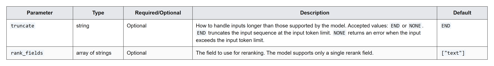

# Rerank results

Improve retrieval quality by reranking initial search results with a hosted or external model to surface the most relevant matches for RAG.

Reranking is used as part of a two-stage vector retrieval process to improve the quality of results. You first query an index for a given number of relevant results, and then you send the query and results to a reranking model. The reranking model scores the results based on their semantic relevance to the query and returns a new, more accurate ranking. This approach is one of the simplest methods for improving quality in retrieval augmented generation (RAG) pipelines.Pinecone provides [hosted reranking models](https://docs.pinecone.io/guides/search/rerank-results#reranking-models) so it’s easy to manage two-stage vector retrieval on a single platform. You can use a hosted model to rerank results as an integrated part of a query, or you can use a hosted model or external model to rerank results as a standalone operation.

To run through this guide in your browser, see the [Rerank example notebook](https://colab.research.google.com/github/pinecone-io/examples/blob/master/docs/pinecone-reranker.ipynb).

## [​](https://docs.pinecone.io/guides/search/rerank-results#integrated-reranking)

Integrated reranking

To rerank initial results as an integrated part of a query, without any extra steps, use the [`search`](https://docs.pinecone.io/reference/api/latest/data-plane/search_records) operation with the `rerank` parameter, including the [hosted reranking model](https://docs.pinecone.io/guides/search/rerank-results#reranking-models) you want to use, the number of reranked results to return, and the fields to use for reranking, if different than the main query.For example, the following code searches for the 3 records most semantically related to a query text and uses the `hosted bge-reranker-v2-m3` model to rerank the results and return only the 2 most relevant documents:

Python

JavaScript

Java

Go

curl

```
from pinecone import Pinecone

pc = Pinecone(api_key="YOUR_API_KEY")

# To get the unique host for an index, 
# see https://docs.pinecone.io/guides/manage-data/target-an-index
index = pc.Index(host="INDEX_HOST")

ranked_results = index.search(
    namespace="example-namespace", 
    query={
        "inputs": {"text": "Disease prevention"}, 
        "top_k": 4
    },
    rerank={
        "model": "bge-reranker-v2-m3",
        "top_n": 2,
        "rank_fields": ["chunk_text"]
    },
    fields=["category", "chunk_text"]
)

print(ranked_results)
```

```
import { Pinecone } from '@pinecone-database/pinecone'

const pc = new Pinecone({ apiKey: "YOUR_API_KEY" })

// To get the unique host for an index, 
// see https://docs.pinecone.io/guides/manage-data/target-an-index
const namespace = pc.index("INDEX_NAME", "INDEX_HOST").namespace("example-namespace");

const response = await namespace.searchRecords({
  query: {
    topK: 2,
    inputs: { text: 'Disease prevention' },
  },
  fields: ['chunk_text', 'category'],
  rerank: {
    model: 'bge-reranker-v2-m3',
    rankFields: ['chunk_text'],
    topN: 2,
  },
});

console.log(response);
```

```
import io.pinecone.clients.Index;
import io.pinecone.configs.PineconeConfig;
import io.pinecone.configs.PineconeConnection;
import org.openapitools.db_data.client.ApiException;
import org.openapitools.db_data.client.model.SearchRecordsRequestRerank;
import org.openapitools.db_data.client.model.SearchRecordsResponse;

import java.util.*;

public class SearchText {
    public static void main(String[] args) throws ApiException {
        PineconeConfig config = new PineconeConfig("YOUR_API_KEY");
        // To get the unique host for an index, 
        // see https://docs.pinecone.io/guides/manage-data/target-an-index
        config.setHost("INDEX_HOST");
        PineconeConnection connection = new PineconeConnection(config);

        Index index = new Index(config, connection, "integrated-dense-java");

        String query = "Disease prevention";
        List<String> fields = new ArrayList<>();
        fields.add("category");
        fields.add("chunk_text");

        List<String>rankFields = new ArrayList<>();
        rankFields.add("chunk_text");
        SearchRecordsRequestRerank rerank = new SearchRecordsRequestRerank()
                .query(query)
                .model("bge-reranker-v2-m3")
                .topN(2)
                .rankFields(rankFields);

        SearchRecordsResponse recordsResponseReranked = index.searchRecordsByText(query,  "example-namespace", fields,4, null, rerank);

        System.out.println(recordsResponseReranked);
    }
}
```

```
package main

import (
    "context"
    "encoding/json"
    "fmt"
    "log"

    "github.com/pinecone-io/go-pinecone/v4/pinecone"
)

func prettifyStruct(obj interface{}) string {
  	bytes, _ := json.MarshalIndent(obj, "", "  ")
    return string(bytes)
}

func main() {
    ctx := context.Background()

    pc, err := pinecone.NewClient(pinecone.NewClientParams{
        ApiKey: "YOUR_API_KEY",
    })
    if err != nil {
        log.Fatalf("Failed to create Client: %v", err)
    }

    // To get the unique host for an index, 
    // see https://docs.pinecone.io/guides/manage-data/target-an-index
    idxConnection, err := pc.Index(pinecone.NewIndexConnParams{Host: "INDEX_HOST", Namespace: "example-namespace"})
    if err != nil {
        log.Fatalf("Failed to create IndexConnection for Host: %v", err)
    } 

    topN := int32(2)
    res, err := idxConnection.SearchRecords(ctx, &pinecone.SearchRecordsRequest{
        Query: pinecone.SearchRecordsQuery{
            TopK: 3,
            Inputs: &map[string]interface{}{
                "text": "Disease prevention",
            },
        },
        Rerank: &pinecone.SearchRecordsRerank{
            Model:      "bge-reranker-v2-m3",
            TopN:       &topN,
            RankFields: []string{"chunk_text"},
        },
        Fields: &[]string{"chunk_text", "category"},
    })
    if err != nil {
        log.Fatalf("Failed to search records: %v", err)
    }
    fmt.Printf(prettifyStruct(res))
}
```

```
INDEX_HOST="INDEX_HOST"
NAMESPACE="YOUR_NAMESPACE"
PINECONE_API_KEY="YOUR_API_KEY"

curl "https://$INDEX_HOST/records/namespaces/$NAMESPACE/search" \
  -H "Accept: application/json" \
  -H "Content-Type: application/json" \
  -H "Api-Key: $PINECONE_API_KEY" \
  -H "X-Pinecone-Api-Version: unstable" \
  -d '{
        "query": {
            "inputs": {"text": "Disease prevention"},
            "top_k": 4
        },
        "rerank": {
            "model": "bge-reranker-v2-m3",
            "top_n": 2,
            "rank_fields": ["chunk_text"]
        },
        "fields": ["category", "chunk_text"]
     }'
```

The response looks as follows. For each hit, the `_score` represents the relevance of a document to the query, normalized between 0 and 1, with scores closer to 1 indicating higher relevance.

Python

JavaScript

Java

Go

curl

```
{'result': {'hits': [{'_id': 'rec3',
                      '_score': 0.004399413242936134,
                      'fields': {'category': 'immune system',
                                 'chunk_text': 'Rich in vitamin C and other '
                                                'antioxidants, apples '
                                                'contribute to immune health '
                                                'and may reduce the risk of '
                                                'chronic diseases.'}},
                     {'_id': 'rec4',
                      '_score': 0.0029235430993139744,
                      'fields': {'category': 'endocrine system',
                                 'chunk_text': 'The high fiber content in '
                                                'apples can also help regulate '
                                                'blood sugar levels, making '
                                                'them a favorable snack for '
                                                'people with diabetes.'}}]},
 'usage': {'embed_total_tokens': 8, 'read_units': 6, 'rerank_units': 1}}
```

```
{
  result: { 
    hits: [ 
      {
        _id: 'rec3',
        _score: 0.004399413242936134,
        fields: {
          category: 'immune system',
          chunk_text: 'Rich in vitamin C and other antioxidants, apples contribute to immune health and may reduce the risk of chronic diseases.'
        }
      },
      {
        _id: 'rec4',
        _score: 0.0029235430993139744,
        fields: {
          category: 'endocrine system',
          chunk_text: 'The high fiber content in apples can also help regulate blood sugar levels, making them a favorable snack for people with diabetes.'
        }
      }
    ]
  },
  usage: { 
    readUnits: 6, 
    embedTotalTokens: 8,
    rerankUnits: 1 
  }
}
```

```
class SearchRecordsResponse {
    result: class SearchRecordsResponseResult {
        hits: [class Hit {
            id: rec3
            score: 0.004399413242936134
            fields: {category=immune system, chunk_text=Rich in vitamin C and other antioxidants, apples contribute to immune health and may reduce the risk of chronic diseases.}
            additionalProperties: null
        }, class Hit {
            id: rec4
            score: 0.0029235430993139744
            fields: {category=endocrine system, chunk_text=The high fiber content in apples can also help regulate blood sugar levels, making them a favorable snack for people with diabetes.}
            additionalProperties: null
        }]
        additionalProperties: null
    }
    usage: class SearchUsage {
        readUnits: 6
        embedTotalTokens: 13
        rerankUnits: 1
        additionalProperties: null
    }
    additionalProperties: null
}
```

```
{
  "result": {
    "hits": [
      {
        "_id": "rec3",
        "_score": 0.13683891,
        "fields": {
          "category": "immune system",
          "chunk_text": "Rich in vitamin C and other antioxidants, apples contribute to immune health and may reduce the risk of chronic diseases."
        }
      },
      {
        "_id": "rec4",
        "_score": 0.0029235430993139744,
        "fields": {
          "category": "endocrine system",
          "chunk_text": "The high fiber content in apples can also help regulate blood sugar levels, making them a favorable snack for people with diabetes."
        }
      }
    ]
  },
  "usage": {
    "read_units": 6,
    "embed_total_tokens": 8,
    "rerank_units": 1
  }
}
```

```
{
    "result": {
        "hits": [
            {
                "_id": "rec3",
                "_score": 0.004433765076100826,
                "fields": {
                    "category": "immune system",
                    "chunk_text": "Rich in vitamin C and other antioxidants, apples contribute to immune health and may reduce the risk of chronic diseases."
                }
            },
            {
                "_id": "rec4",
                "_score": 0.0029121784027665854,
                "fields": {
                    "category": "endocrine system",
                    "chunk_text": "The high fiber content in apples can also help regulate blood sugar levels, making them a favorable snack for people with diabetes."
                }
            }
        ]
    },
    "usage": {
        "embed_total_tokens": 8,
        "read_units": 6,
        "rerank_units": 1
    }
}
```

## [​](https://docs.pinecone.io/guides/search/rerank-results#standalone-reranking)

Standalone reranking

To rerank initial results as a standalone operation, use the [`rerank`](https://docs.pinecone.io/reference/api/latest/inference/rerank) operation with the [hosted reranking model](https://docs.pinecone.io/guides/search/rerank-results#reranking-models) you want to use, the query results and the query, the number of ranked results to return, the field to use for reranking, and any other model-specific parameters.For example, the following code uses the hosted `bge-reranker-v2-m3` model to rerank the values of the `documents.chunk_text` fields based on their relevance to the query and return only the 2 most relevant documents, along with their score:

Python

JavaScript

Java

Go

curl

```
from pinecone import Pinecone

pc = Pinecone(api_key="YOUR_API_KEY")

ranked_results = pc.inference.rerank(
    model="bge-reranker-v2-m3",
    query="What is AAPL's outlook, considering both product launches and market conditions?",
    documents=[
        {"id": "vec2", "chunk_text": "Analysts suggest that AAPL'\''s upcoming Q4 product launch event might solidify its position in the premium smartphone market."},
        {"id": "vec3", "chunk_text": "AAPL'\''s strategic Q3 partnerships with semiconductor suppliers could mitigate component risks and stabilize iPhone production."},
        {"id": "vec1", "chunk_text": "AAPL reported a year-over-year revenue increase, expecting stronger Q3 demand for its flagship phones."},
    ],
    top_n=2,
    rank_fields=["chunk_text"],
    return_documents=True,
    parameters={
        "truncate": "END"
    }
)

print(ranked_results)
```

```
import { Pinecone } from '@pinecone-database/pinecone';

const pc = new Pinecone({ apiKey: 'YOUR_API_KEY' });

const rerankingModel = 'bge-reranker-v2-m3';

const query = "What is AAPL's outlook, considering both product launches and market conditions?";

const documents = [
  { id: 'vec2', chunk_text: "Analysts suggest that AAPL's upcoming Q4 product launch event might solidify its position in the premium smartphone market." },
  { id: 'vec3', chunk_text: "AAPL's strategic Q3 partnerships with semiconductor suppliers could mitigate component risks and stabilize iPhone production." },
  { id: 'vec1', chunk_text: "AAPL reported a year-over-year revenue increase, expecting stronger Q3 demand for its flagship phones." },
];

const rerankOptions = {
  topN: 2,
  rankFields: ['chunk_text'],
  returnDocuments: true,
  parameters: {
    truncate: 'END'
  }, 
};

const rankedResults = await pc.inference.rerank(
  rerankingModel,
  query,
  documents,
  rerankOptions
);

console.log(rankedResults);
```

```
import io.pinecone.clients.Inference;
import io.pinecone.clients.Pinecone;
import org.openapitools.inference.client.model.RerankResult;
import org.openapitools.inference.client.ApiException;

import java.util.*;

public class RerankExample {
    public static void main(String[] args) throws ApiException {
        Pinecone pc = new Pinecone.Builder("YOUR_API_KEY").build();
        Inference inference = pc.getInferenceClient();

        // The model to use for reranking
        String model = "bge-reranker-v2-m3";

        // The query to rerank documents against
        String query = "What is AAPL's outlook, considering both product launches and market conditions?";

        // Add the documents to rerank
        List<Map<String, Object>> documents = new ArrayList<>();
        Map<String, Object> doc1 = new HashMap<>();
        doc1.put("id", "vec2");
        doc1.put("chunk_text", "Analysts suggest that AAPL's upcoming Q4 product launch event might solidify its position in the premium smartphone market.");
        documents.add(doc1);

        Map<String, Object> doc2 = new HashMap<>();
        doc2.put("id", "vec3");
        doc2.put("chunk_text", "AAPL's strategic Q3 partnerships with semiconductor suppliers could mitigate component risks and stabilize iPhone production");
        documents.add(doc2);

        Map<String, Object> doc3 = new HashMap<>();
        doc3.put("id", "vec1");
        doc3.put("chunk_text", "AAPL reported a year-over-year revenue increase, expecting stronger Q3 demand for its flagship phones.");
        documents.add(doc3);

        // The fields to rank the documents by. If not provided, the default is "text"
        List<String> rankFields = Arrays.asList("chunk_text");

        // The number of results to return sorted by relevance. Defaults to the number of inputs
        int topN = 2;

        // Whether to return the documents in the response
        boolean returnDocuments = true;

        // Additional model-specific parameters for the reranker
        Map<String, Object> parameters = new HashMap<>();
        parameters.put("truncate", "END");

        // Send ranking request
        RerankResult result = inference.rerank(model, query, documents, rankFields, topN, returnDocuments, parameters);

        // Get ranked data
        System.out.println(result.getData());
    }
}
```

```
package main

import (
	"context"
	"encoding/json"
	"fmt"
	"log"

	"github.com/pinecone-io/go-pinecone/v4/pinecone"
)

func prettifyStruct(obj interface{}) string {
	bytes, _ := json.MarshalIndent(obj, "", "  ")
	return string(bytes)
}

func main() {
	ctx := context.Background()

	pc, err := pinecone.NewClient(pinecone.NewClientParams{
		ApiKey: "YOUR_API_KEY",
	})
	if err != nil {
		log.Fatalf("Failed to create Client: %v", err)
	}

	rerankModel := "bge-reranker-v2-m3"
	topN := 2
	returnDocuments := true
	documents := []pinecone.Document{
		{"id": "vec2", "chunk_text": "Analysts suggest that AAPL's upcoming Q4 product launch event might solidify its position in the premium smartphone market."},
		{"id": "vec3", "chunk_text": "AAPL's strategic Q3 partnerships with semiconductor suppliers could mitigate component risks and stabilize iPhone production."},
		{"id": "vec1", "chunk_text": "AAPL reported a year-over-year revenue increase, expecting stronger Q3 demand for its flagship phones."},
	}

	ranking, err := pc.Inference.Rerank(ctx, &pinecone.RerankRequest{
		Model:           rerankModel,
		Query:           "What is AAPL's outlook, considering both product launches and market conditions?",
		ReturnDocuments: &returnDocuments,
		TopN:            &topN,
		RankFields:      &[]string{"chunk_text"},
		Documents:       documents,
	})
	if err != nil {
		log.Fatalf("Failed to rerank: %v", err)
	}
	fmt.Printf(prettifyStruct(ranking))
}
```

```
PINECONE_API_KEY="YOUR_API_KEY"

curl https://api.pinecone.io/rerank \
  -H "Content-Type: application/json" \
  -H "Accept: application/json" \
  -H "X-Pinecone-Api-Version: 2025-10" \
  -H "Api-Key: $PINECONE_API_KEY" \
  -d '{
  "model": "bge-reranker-v2-m3",
  "query": "What is AAPL'\''s outlook, considering both product launches and market conditions?",
  "documents": [
    {"id": "vec2", "chunk_text": "Analysts suggest that AAPL'\''s upcoming Q4 product launch event might solidify its position in the premium smartphone market."},
    {"id": "vec3", "chunk_text": "AAPL'\''s strategic Q3 partnerships with semiconductor suppliers could mitigate component risks and stabilize iPhone production."},
    {"id": "vec1", "chunk_text": "AAPL reported a year-over-year revenue increase, expecting stronger Q3 demand for its flagship phones."}
  ],
  "top_n": 2,
  "rank_fields": ["chunk_text"],
  "return_documents": true,
  "parameters": {
    "truncate": "END"
  }
}'
```

The response looks as follows. For each hit, the _score represents the relevance of a document to the query, normalized between 0 and 1, with scores closer to 1 indicating higher relevance.

Python

JavaScript

Java

Go

curl

```
RerankResult(
  model='bge-reranker-v2-m3',
  data=[{
    index=0,
    score=0.004166256,
    document={
        id='vec2',
        chunk_text="Analysts suggest that AAPL'''s upcoming Q4 product launch event might solidify its position in the premium smartphone market."
    }
  },{
    index=2,
    score=0.0011513996,
    document={
        id='vec1',
        chunk_text='AAPL reported a year-over-year revenue increase, expecting stronger Q3 demand for its flagship phones.'
    }
  }],
  usage={'rerank_units': 1}
)
```

```
{
  model: 'bge-reranker-v2-m3',
  data: [
    { index: 0, score: 0.004166256, document: [id: 'vec2', chunk_text: "Analysts suggest that AAPL'''s upcoming Q4 product launch event might solidify its position in the premium smartphone market."] },
    { index: 2, score: 0.0011513996, document: [id: 'vec1', chunk_text: 'AAPL reported a year-over-year revenue increase, expecting stronger Q3 demand for its flagship phones.'] }
  ],
  usage: { rerankUnits: 1 }
}
```

```
[class RankedDocument {
    index: 0
    score: 0.0063143647
    document: {id=vec2, chunk_text=Analysts suggest that AAPL's upcoming Q4 product launch event might solidify its position in the premium smartphone market.}
    additionalProperties: null
}, class RankedDocument {
    index: 2
    score: 0.0011513996
    document: {id=vec1, chunk_text=AAPL reported a year-over-year revenue increase, expecting stronger Q3 demand for its flagship phones.}
    additionalProperties: null
}]
```

```
{
  "data": [
    {
      "document": {
        "id": "vec2",
        "chunk_text": "Analysts suggest that AAPL's upcoming Q4 product launch event might solidify its position in the premium smartphone market."
      },
      "index": 0,
      "score": 0.0063143647
    },
    {
      "document": {
        "id": "vec1",
        "chunk_text": "AAPL reported a year-over-year revenue increase, expecting stronger Q3 demand for its flagship phones."
      },
      "index": 2,
      "score": 0.0011513996
    }
  ],
  "model": "bge-reranker-v2-m3",
  "usage": {
    "rerank_units": 1
  }
}
```

```
{
    "model": "bge-reranker-v2-m3",
    "data": [
        {
            "index": 0,
            "document": {
                "chunk_text": "Analysts suggest that AAPL's upcoming Q4 product launch event might solidify its position in the premium smartphone market.",
                "id": "vec2"
            },
            "score": 0.007606672
        },
        {
            "index": 3,
            "document": {
                "chunk_text": "AAPL reported a year-over-year revenue increase, expecting stronger Q3 demand for its flagship phones.",
                "id": "vec1"
            },
            "score": 0.0013406205
        }
    ],
    "usage": {
        "rerank_units": 1
    }
}
```

## [​](https://docs.pinecone.io/guides/search/rerank-results#rerank-results-on-the-default-field)

Rerank results on the default field

To [rerank search results](https://docs.pinecone.io/reference/api/latest/inference/rerank), specify a [supported reranking model](https://docs.pinecone.io/guides/search/rerank-results#reranking-models), and provide documents and a query as well as other model-specific parameters. By default, Pinecone expects the documents to be in the `documents.text` field.For example, the following request uses the `bge-reranker-v2-m3` reranking model to rerank the values of the `documents.text` field based on their relevance to the query, `"The tech company Apple is known for its innovative products like the iPhone."`.

With `truncate` set to `"END"`, the input sequence (`query` + `document`) is truncated at the token limit (`1024`); to return an error instead, you’d set `truncate` to `"NONE"` or leave the parameter out.

Python

JavaScript

Java

Go

curl

```
from pinecone.grpc import PineconeGRPC as Pinecone

pc = Pinecone(api_key="YOUR_API_KEY")

result = pc.inference.rerank(
    model="bge-reranker-v2-m3",
    query="The tech company Apple is known for its innovative products like the iPhone.",
    documents=[
        {"id": "vec1", "text": "Apple is a popular fruit known for its sweetness and crisp texture."},
        {"id": "vec2", "text": "Many people enjoy eating apples as a healthy snack."},
        {"id": "vec3", "text": "Apple Inc. has revolutionized the tech industry with its sleek designs and user-friendly interfaces."},
        {"id": "vec4", "text": "An apple a day keeps the doctor away, as the saying goes."},
    ],
    top_n=4,
    return_documents=True,
    parameters={
        "truncate": "END"
    }
)

print(result)
```

```
import { Pinecone } from '@pinecone-database/pinecone';

const pc = new Pinecone({ apiKey: 'YOUR_API_KEY' });

const rerankingModel = 'bge-reranker-v2-m3';

const query = 'The tech company Apple is known for its innovative products like the iPhone.';

const documents = [
  { id: 'vec1', text: 'Apple is a popular fruit known for its sweetness and crisp texture.' },
  { id: 'vec2', text: 'Many people enjoy eating apples as a healthy snack.' },
  { id: 'vec3', text: 'Apple Inc. has revolutionized the tech industry with its sleek designs and user-friendly interfaces.' },
  { id: 'vec4', text: 'An apple a day keeps the doctor away, as the saying goes.' },
];

const rerankOptions = {
  topN: 4,
  returnDocuments: true,
  parameters: {
    truncate: 'END'
  }, 
};

const response = await pc.inference.rerank(
  rerankingModel,
  query,
  documents,
  rerankOptions
);

console.log(response);
```

```
import io.pinecone.clients.Inference;
import io.pinecone.clients.Pinecone;
import org.openapitools.inference.client.model.RerankResult;
import org.openapitools.inference.client.ApiException;

import java.util.*;

public class RerankExample {
    public static void main(String[] args) throws ApiException {
        Pinecone pc = new Pinecone.Builder("YOUR_API_KEY").build();
        Inference inference = pc.getInferenceClient();

        // The model to use for reranking
        String model = "bge-reranker-v2-m3";

        // The query to rerank documents against
        String query = "The tech company Apple is known for its innovative products like the iPhone.";

        // Add the documents to rerank
        List<Map<String, Object>> documents = new ArrayList<>();
        Map<String, Object> doc1 = new HashMap<>();
        doc1.put("id", "vec1");
        doc1.put("text", "Apple is a popular fruit known for its sweetness and crisp texture.");
        documents.add(doc1);

        Map<String, Object> doc2 = new HashMap<>();
        doc2.put("id", "vec2");
        doc2.put("text", "Many people enjoy eating apples as a healthy snack.");
        documents.add(doc2);

        Map<String, Object> doc3 = new HashMap<>();
        doc3.put("id", "vec3");
        doc3.put("text", "Apple Inc. has revolutionized the tech industry with its sleek designs and user-friendly interfaces.");
        documents.add(doc3);

        Map<String, Object> doc4 = new HashMap<>();
        doc4.put("id", "vec4");
        doc4.put("text", "An apple a day keeps the doctor away, as the saying goes.");
        documents.add(doc4);

        // The fields to rank the documents by. If not provided, the default is "text"
        List<String> rankFields = Arrays.asList("text");

        // The number of results to return sorted by relevance. Defaults to the number of inputs
        int topN = 4;

        // Whether to return the documents in the response
        boolean returnDocuments = true;

        // Additional model-specific parameters for the reranker
        Map<String, Object> parameters = new HashMap<>();
        parameters.put("truncate", "END");

        // Send ranking request
        RerankResult result = inference.rerank(model, query, documents, rankFields, topN, returnDocuments, parameters);

        // Get ranked data
        System.out.println(result.getData());
    }
}
```

```
package main

import (
    "context"
    "fmt"
    "log"

    "github.com/pinecone-io/go-pinecone/v4/pinecone"
)

func main() {
    ctx := context.Background()

    pc, err := pinecone.NewClient(pinecone.NewClientParams{
        ApiKey: "YOUR_API_KEY",
    })
    if err != nil {
        log.Fatalf("Failed to create Client: %v", err)
    }

    rerankModel := "bge-reranker-v2-m3"
    topN := 4
    returnDocuments := true
    documents := []pinecone.Document{
        {"id": "vec1", "text": "Apple is a popular fruit known for its sweetness and crisp texture."},
        {"id": "vec2", "text": "Many people enjoy eating apples as a healthy snack."},
        {"id": "vec3", "text": "Apple Inc. has revolutionized the tech industry with its sleek designs and user-friendly interfaces."},
        {"id": "vec4", "text": "An apple a day keeps the doctor away, as the saying goes."},
    }

    ranking, err := pc.Inference.Rerank(ctx, &pinecone.RerankRequest{
        Model:           rerankModel,
        Query:           "The tech company Apple is known for its innovative products like the iPhone.",
        ReturnDocuments: &returnDocuments,
        TopN:            &topN,
        RankFields:      &[]string{"text"},
        Documents:       documents,
    })
    if err != nil {
        log.Fatalf("Failed to rerank: %v", err)
    }
    fmt.Printf("Rerank result: %+v\n", ranking)
}
```

```
PINECONE_API_KEY="YOUR_API_KEY"

curl https://api.pinecone.io/rerank \
  -H "Content-Type: application/json" \
  -H "Accept: application/json" \
  -H "X-Pinecone-Api-Version: 2025-10" \
  -H "Api-Key: $PINECONE_API_KEY" \
-d '{
  "model": "bge-reranker-v2-m3",
  "query": "The tech company Apple is known for its innovative products like the iPhone.",
  "return_documents": true,
  "top_n": 4,
  "documents": [
    {"id": "vec1", "text": "Apple is a popular fruit known for its sweetness and crisp texture."},
    {"id": "vec2", "text": "Many people enjoy eating apples as a healthy snack."},
    {"id": "vec3", "text": "Apple Inc. has revolutionized the tech industry with its sleek designs and user-friendly interfaces."},
    {"id": "vec4", "text": "An apple a day keeps the doctor away, as the saying goes."}
  ],
  "parameters": {
    "truncate": "END"
  }
}'
```

The returned object contains documents with relevance scores:

Normalized between 0 and 1, the `score` represents the relevance of a passage to the query, with scores closer to 1 indicating higher relevance.

Python

JavaScript

Java

Go

curl

```
RerankResult(
  model='bge-reranker-v2-m3',
  data=[
    { index=2, score=0.48357219,
      document={id="vec3", text="Apple Inc. has re..."} },
    { index=0, score=0.048405956,
      document={id="vec1", text="Apple is a popula..."} },
    { index=3, score=0.007846239,
      document={id="vec4", text="An apple a day ke..."} },
    { index=1, score=0.0006563728,
      document={id="vec2", text="Many people enjoy..."} }
  ],
  usage={'rerank_units': 1}
)
```

```
{
  model: 'bge-reranker-v2-m3',
  data: [
    { index: 2, score: 0.48357219, document: [Object] },
    { index: 0, score: 0.048405956, document: [Object] },
    { index: 3, score: 0.007846239, document: [Object] },
    { index: 1, score: 0.0006563728, document: [Object] }
  ],
  usage: { rerankUnits: 1 }
}
```

```
[class RankedDocument {
    index: 2
    score: 0.48357219
    document: {id=vec3, text=Apple Inc. has revolutionized the tech industry with its sleek designs and user-friendly interfaces.}
    additionalProperties: null
}, class RankedDocument {
    index: 0
    score: 0.048405956
    document: {id=vec1, text=Apple is a popular fruit known for its sweetness and crisp texture.}
    additionalProperties: null
}, class RankedDocument {
    index: 3
    score: 0.007846239
    document: {id=vec4, text=An apple a day keeps the doctor away, as the saying goes.}
    additionalProperties: null
}, class RankedDocument {
    index: 1
    score: 0.0006563728
    document: {id=vec2, text=Many people enjoy eating apples as a healthy snack.}
    additionalProperties: null
}]
```

```
Rerank result: {
  "data": [
    {
      "document": {
        "id": "vec3",
        "text": "Apple Inc. has revolutionized the tech industry with its sleek designs and user-friendly interfaces."
      },
      "index": 2,
      "score": 0.48357219
    },
    {
      "document": {
        "id": "vec1",
        "text": "Apple is a popular fruit known for its sweetness and crisp texture."
      },
      "index": 0,
      "score": 0.048405956
    },
    {
      "document": {
        "id": "vec4",
        "text": "An apple a day keeps the doctor away, as the saying goes."
      },
      "index": 3,
      "score": 0.007846239
    },
    {
      "document": {
        "id": "vec2",
        "text": "Many people enjoy eating apples as a healthy snack."
      },
      "index": 1,
      "score": 0.0006563728
    }
  ],
  "model": "bge-reranker-v2-m3",
  "usage": {
    "rerank_units": 1
  }
}
```

```
{
  "data":[
    {
      "index":2,
      "document":{
        "id":"vec3",
        "text":"Apple Inc. has revolutionized the tech industry with its sleek designs and user-friendly interfaces."
      },
      "score":0.47654688
    },
    {
      "index":0,
      "document":{
        "id":"vec1",
        "text":"Apple is a popular fruit known for its sweetness and crisp texture."
      },
      "score":0.047963805
    },
    {
      "index":3,
      "document":{
        "id":"vec4",
        "text":"An apple a day keeps the doctor away, as the saying goes."
      },
      "score":0.007587992
    },
    {
      "index":1,
      "document":{
        "id":"vec2",
        "text":"Many people enjoy eating apples as a healthy snack."
      },
      "score":0.0006491712
    }
  ],
  "usage":{
    "rerank_units":1
  }
}
```

## [​](https://docs.pinecone.io/guides/search/rerank-results#rerank-results-on-a-custom-field)

Rerank results on a custom field

To [rerank results](https://docs.pinecone.io/reference/api/latest/inference/rerank) on a field other than `documents.text`, provide the `rank_fields` parameter to specify the fields on which to rerank.

The [`bge-reranker-v2-m3`](https://docs.pinecone.io/guides/search/rerank-results#bge-reranker-v2-m3) and [`pinecone-rerank-v0`](https://docs.pinecone.io/guides/search/rerank-results#pinecone-rerank-v0) models support only a single rerank field. [`cohere-rerank-4-fast`](https://docs.pinecone.io/guides/search/rerank-results#cohere-rerank-4-fast) and [`cohere-rerank-3.5`](https://docs.pinecone.io/guides/search/rerank-results#cohere-rerank-3-5) support multiple rerank fields, ranked based on the order of the fields specified.

For example, the following request reranks documents based on the values of the `documents.my_field` field:

Python

JavaScript

Java

Go

curl

```
from pinecone.grpc import PineconeGRPC as Pinecone

pc = Pinecone(api_key="YOUR_API_KEY")

result = pc.inference.rerank(
    model="bge-reranker-v2-m3",
    query="The tech company Apple is known for its innovative products like the iPhone.",
    documents=[
        {"id": "vec1", "my_field": "Apple is a popular fruit known for its sweetness and crisp texture."},
        {"id": "vec2", "my_field": "Many people enjoy eating apples as a healthy snack."},
        {"id": "vec3", "my_field": "Apple Inc. has revolutionized the tech industry with its sleek designs and user-friendly interfaces."},
        {"id": "vec4", "my_field": "An apple a day keeps the doctor away, as the saying goes."},
    ],
    rank_fields=["my_field"],
    top_n=4,
    return_documents=True,
    parameters={
        "truncate": "END"
    }
)
```

```
import { Pinecone } from '@pinecone-database/pinecone';

const pc = new Pinecone({ apiKey: 'YOUR_API_KEY' });

const rerankingModel = 'bge-reranker-v2-m3';

const query = 'The tech company Apple is known for its innovative products like the iPhone.';

const documents = [
  { id: 'vec1', my_field: 'Apple is a popular fruit known for its sweetness and crisp texture.' },
  { id: 'vec2', my_field: 'Many people enjoy eating apples as a healthy snack.' },
  { id: 'vec3', my_field: 'Apple Inc. has revolutionized the tech industry with its sleek designs and user-friendly interfaces.' },
  { id: 'vec4', my_field: 'An apple a day keeps the doctor away, as the saying goes.' },
];

const rerankOptions = {
  rankFields: ['my_field'],
  topN: 4,
  returnDocuments: true,
  parameters: {
    truncate: "END"
  }, 
};

const response = await pc.inference.rerank(
  rerankingModel,
  query,
  documents,
  rerankOptions
);

console.log(response);
```

```
import io.pinecone.clients.Inference;
import io.pinecone.clients.Pinecone;
import org.openapitools.inference.client.model.RerankResult;
import org.openapitools.inference.client.ApiException;

import java.util.*;

public class RerankExample {
    public static void main(String[] args) throws ApiException {
        Pinecone pc = new Pinecone.Builder("YOUR_API_KEY").build();
        Inference inference = pc.getInferenceClient();

        // The model to use for reranking
        String model = "bge-reranker-v2-m3";

        // The query to rerank documents against
        String query = "The tech company Apple is known for its innovative products like the iPhone.";

        // Add the documents to rerank
        List<Map<String, String>> documents = new ArrayList<>();
        Map<String, String> doc1 = new HashMap<>();
        doc1.put("id", "vec1");
        doc1.put("my_field", "Apple is a popular fruit known for its sweetness and crisp texture.");
        documents.add(doc1);

        Map<String, String> doc2 = new HashMap<>();
        doc2.put("id", "vec2");
        doc2.put("my_field", "Many people enjoy eating apples as a healthy snack.");
        documents.add(doc2);

        Map<String, String> doc3 = new HashMap<>();
        doc3.put("id", "vec3");
        doc3.put("my_field", "Apple Inc. has revolutionized the tech industry with its sleek designs and user-friendly interfaces.");
        documents.add(doc3);

        Map<String, String> doc4 = new HashMap<>();
        doc4.put("id", "vec4");
        doc4.put("my_field", "An apple a day keeps the doctor away, as the saying goes.");
        documents.add(doc4);

        // The fields to rank the documents by. If not provided, the default is "text"
        List<String> rankFields = Arrays.asList("my_field");

        // The number of results to return sorted by relevance. Defaults to the number of inputs
        int topN = 2;

        // Whether to return the documents in the response
        boolean returnDocuments = true;

        // Additional model-specific parameters for the reranker
        Map<String, String> parameters = new HashMap<>();
        parameters.put("truncate", "END");

        // Send ranking request
        RerankResult result = inference.rerank(model, query, documents, rankFields, topN, returnDocuments, parameters);

        // Get ranked data
        System.out.println(result.getData());
    }
}
```

```
package main

import (
    "context"
    "fmt"
    "log"

    "github.com/pinecone-io/go-pinecone/v4/pinecone"
)

func main() {
    ctx := context.Background()

    pc, err := pinecone.NewClient(pinecone.NewClientParams{
        ApiKey: "YOUR_API_KEY",
    })
    if err != nil {
        log.Fatalf("Failed to create Client: %v", err)
    }

    rerankModel := "bge-reranker-v2-m3"
    topN := 4
    returnDocuments := true
    documents := []pinecone.Document{
        {"id": "vec1", "my_field": "Apple is a popular fruit known for its sweetness and crisp texture."},
        {"id": "vec2", "my_field": "Many people enjoy eating apples as a healthy snack."},
        {"id": "vec3", "my_field": "Apple Inc. has revolutionized the tech industry with its sleek designs and user-friendly interfaces."},
        {"id": "vec4", "my_field": "An apple a day keeps the doctor away, as the saying goes."},
    }

    ranking, err := pc.Inference.Rerank(ctx, &pinecone.RerankRequest{
        Model:           rerankModel,
        Query:           "The tech company Apple is known for its innovative products like the iPhone.",
        ReturnDocuments: &returnDocuments,
        TopN:            &topN,
        RankFields:      &[]string{"my_field"},
        Documents:       documents,
    })
    if err != nil {
        log.Fatalf("Failed to rerank: %v", err)
    }
    fmt.Printf("Rerank result: %+v\n", ranking)
}
```

```
PINECONE_API_KEY="YOUR_API_KEY"

curl "https://api.pinecone.io/rerank" \
-H "Content-Type: application/json" \
-H "Accept: application/json" \
  -H "X-Pinecone-Api-Version: 2025-10" \
  -H "Api-Key: $PINECONE_API_KEY" \
-d '{
  "model": "bge-reranker-v2-m3",
  "query": "The tech company Apple is known for its innovative products like the iPhone.",
  "return_documents": true,
  "top_n": 4,
  "rank_fields": ["my_field"],
  "documents": [
    {"id": "vec1", "my_field": "Apple is a popular fruit known for its sweetness and crisp texture."},
    {"id": "vec2", "my_field": "Many people enjoy eating apples as a healthy snack."},
    {"id": "vec3", "my_field": "Apple Inc. has revolutionized the tech industry with its sleek designs and user-friendly interfaces."},
    {"id": "vec4", "my_field": "An apple a day keeps the doctor away, as the saying goes."}
  ],
  "parameters": {
    "truncate": "END"
  }
}'
```

## [​](https://docs.pinecone.io/guides/search/rerank-results#reranking-models)

Reranking models

Pinecone hosts several reranking models so it’s easy to manage two-stage vector retrieval on a single platform. You can use a hosted model to rerank results as an integrated part of a query, or you can use a hosted model to rerank results as a standalone operation.The following reranking models are hosted by Pinecone.

To understand how cost is calculated for reranking, see [Reranking cost](https://docs.pinecone.io/guides/manage-cost/understanding-cost#reranking). To get model details via the API, see [List models](https://docs.pinecone.io/reference/api/latest/inference/list_models) and [Describe a model](https://docs.pinecone.io/reference/api/latest/inference/describe_model).

cohere-rerank-4-fast

[`cohere-rerank-4-fast`](https://docs.pinecone.io/models/cohere-rerank-4-fast) is Cohere’s latest reranking model (Cohere Rerank 4.0 Fast), improving relevance quality for a wide range of enterprise search applications. Cohere Rerank 4.0 is hosted on Azure AI under the Global Standard deployment type, and requests may be processed in regions outside the United States.**Details**
*   Modality: Text
*   Max tokens per document: 8,192
*   Max documents: 250

The relevance scores produced by `cohere-rerank-4-fast` are not directly comparable to those from `cohere-rerank-3.5`. This does not affect sorting, but any application logic that uses a fixed score threshold to make decisions must be re-calibrated for the new model.For rate limits, see [Rerank requests per minute](https://docs.pinecone.io/reference/api/database-limits#rerank-requests-per-minute-per-model) and [Rerank requests per month](https://docs.pinecone.io/reference/api/database-limits#rerank-requests-per-month-per-model).**Parameters**The `cohere-rerank-4-fast` model supports the following parameters:



| Parameter | Type | Required/Optional | Description | Default |
| --- | --- | --- | --- | --- |
| `max_tokens_per_doc` | integer | Optional | Documents longer than this are truncated. Max `4096`. | `1024` |
| `rank_fields` | array of strings | Optional | The fields to use for reranking, in priority order (e.g., `["field1", "field2"]`). | `["text"]` |

cohere-rerank-3.5

`cohere-rerank-3.5` is deprecated as of July 1, 2026. Since August 31, 2026, requests to `cohere-rerank-3.5` are served by [`cohere-rerank-4-fast`](https://docs.pinecone.io/guides/search/rerank-results#cohere-rerank-4-fast). Update your rerank requests to specify `cohere-rerank-4-fast` directly. Because `cohere-rerank-4-fast` returns different relevance scores, re-tune any hard-coded score thresholds against it.

[`cohere-rerank-3.5`](https://docs.pinecone.io/models/cohere-rerank-3.5) is Cohere’s previous-generation reranking model, balancing performance and latency for a wide range of enterprise search applications.**Details**
*   Modality: Text
*   Max tokens per query and document pair: 40,000
*   Max documents: 200

For rate limits, see [Rerank requests per minute](https://docs.pinecone.io/reference/api/database-limits#rerank-requests-per-minute-per-model) and [Rerank request per month](https://docs.pinecone.io/reference/api/database-limits#rerank-requests-per-month-per-model).**Parameters**The `cohere-rerank-3.5` model supports the following parameters:



| Parameter | Type | Required/Optional | Description |  |
| --- | --- | --- | --- | --- |
| `max_chunks_per_doc` | integer | Optional | Long documents will be automatically truncated to the specified number of chunks. Accepted range: `1 - 3072`. |  |
| `rank_fields` | array of strings | Optional | The fields to use for reranking. The model reranks based on the order of the fields specified (e.g., `["field1", "field2", "field3"]`). | `["text"]` |

bge-reranker-v2-m3

[`bge-reranker-v2-m3`](https://docs.pinecone.io/models/bge-reranker-v2-m3) is a high-performance, multilingual reranking model that works well on messy data and short queries expected to return medium-length passages of text (1-2 paragraphs).**Details**
*   Modality: Text
*   Max tokens per query and document pair: 1024
*   Max documents: 100

For rate limits, see [Rerank requests per minute](https://docs.pinecone.io/reference/api/database-limits#rerank-requests-per-minute-per-model) and [Rerank request per month](https://docs.pinecone.io/reference/api/database-limits#rerank-requests-per-month-per-model).**Parameters**The `bge-reranker-v2-m3` model supports the following parameters:


| Parameter | Type | Required/Optional | Description | Default |
| --- | --- | --- | --- | --- |
| `truncate` | string | Optional | How to handle inputs longer than those supported by the model. Accepted values: `END` or `NONE`. `END` truncates the input sequence at the input token limit. `NONE` returns an error when the input exceeds the input token limit. | `NONE` |
| `rank_fields` | array of strings | Optional | The field to use for reranking. The model supports only a single rerank field. | `["text"]` |

pinecone-rerank-v0

[`pinecone-rerank-v0`](https://docs.pinecone.io/models/pinecone-rerank-v0) is a state of the art reranking model that out-performs competitors on widely accepted benchmarks. It can handle chunks up to 512 tokens (1-2 paragraphs).**Details**
*   Modality: Text
*   Max tokens per query and document pair: 512
*   Max documents: 100

For rate limits, see [Rerank requests per minute](https://docs.pinecone.io/reference/api/database-limits#rerank-requests-per-minute-per-model) and [Rerank request per month](https://docs.pinecone.io/reference/api/database-limits#rerank-requests-per-month-per-model).**Parameters**The `pinecone-rerank-v0` model supports the following parameters:



| Parameter | Type | Required/Optional | Description | Default |
| --- | --- | --- | --- | --- |
| `truncate` | string | Optional | How to handle inputs longer than those supported by the model. Accepted values: `END` or `NONE`. `END` truncates the input sequence at the input token limit. `NONE` returns an error when the input exceeds the input token limit. | `END` |
| `rank_fields` | array of strings | Optional | The field to use for reranking. The model supports only a single rerank field. | `["text"]` |
