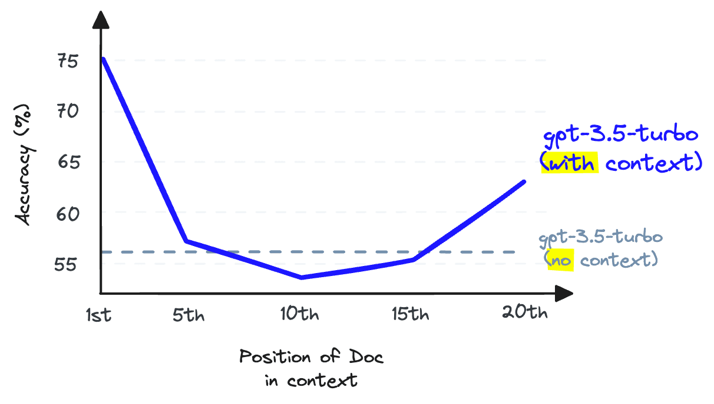
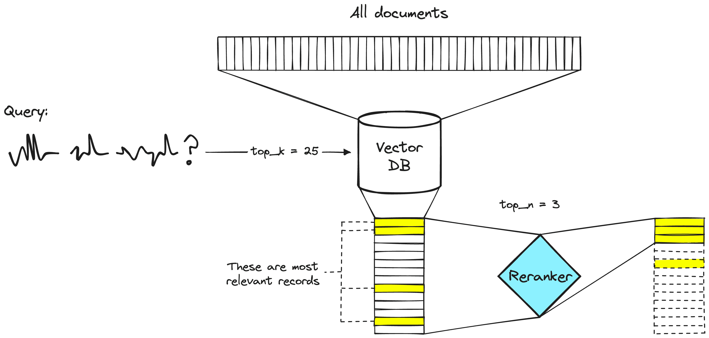
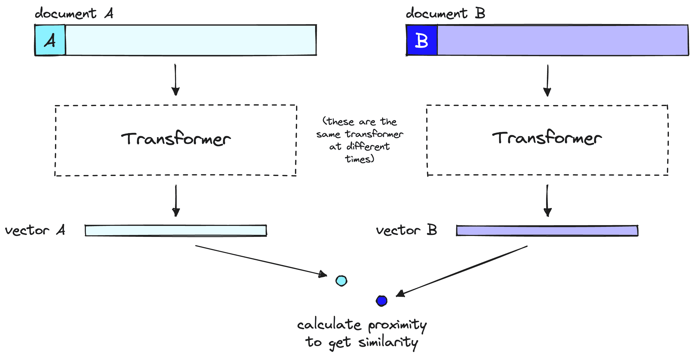
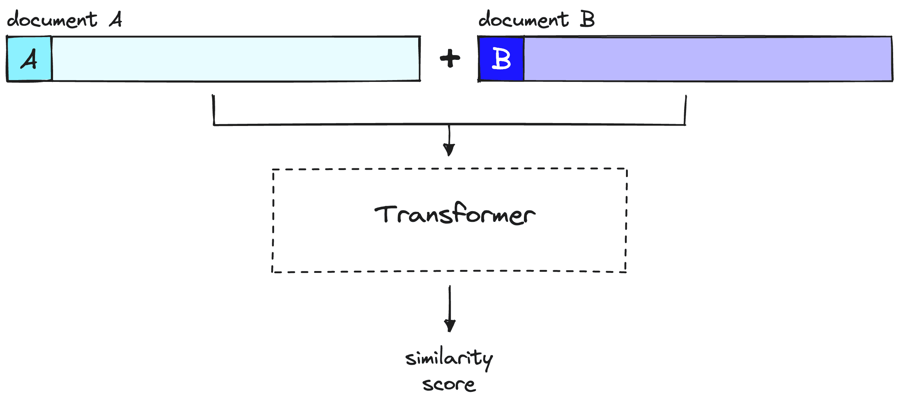
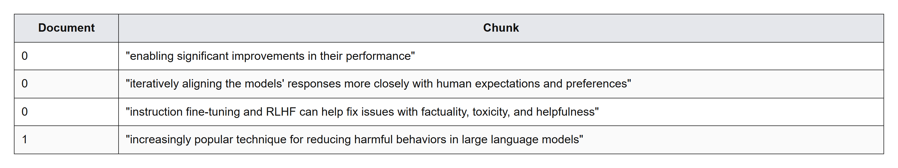
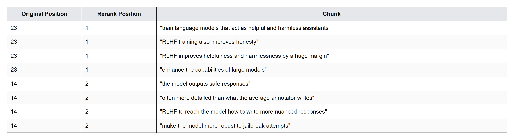

Title: Rerankers and Two-Stage Retrieval

URL Source: https://www.pinecone.io/learn/series/rag/rerankers/

Published Time: Mon, 19 Aug 2024 22:15:10 GMT

Markdown Content:
[Retrieval Augmented Generation (RAG)](https://www.pinecone.io/learn/retrieval-augmented-generation/) is an overloaded term. It promises the world, but after developing a RAG pipeline, there are many of us left wondering why it doesn't work as well as we had expected.

As with most tools, RAG is easy to use but hard to master. The truth is that there is more to RAG than putting documents into a vector DB and adding an LLM on top. That _can work_, but it won't always.

This ebook aims to tell you what to do when out-of-the-box RAG _doesn't_ work. In this first chapter, we'll look at what is often the easiest and fastest to implement solution for suboptimal RAG pipelines — we'll be learning about _rerankers_.

Video companion for this chapter.

* * *

## Recall vs. Context Windows

Before jumping into the solution, let's talk about the problem. With RAG, we are performing a _semantic search_ across many text documents — these could be tens of thousands up to tens of billions of documents.

To ensure fast search times at scale, we typically use vector search — that is, we transform our text into vectors, place them all into a vector space, and compare their proximity to a query vector using a similarity metric like cosine similarity.

For vector search to work, we need vectors. These vectors are essentially compressions of the "meaning" behind some text into (typically) 768 or 1536-dimensional vectors. There is some information loss because we're compressing this information into a single vector.

Because of this information loss, we often see that the top three (for example) vector search documents will miss relevant information. Unfortunately, the retrieval may return relevant information below our `top_k` cutoff.

What do we do if relevant information at a lower position would help our LLM formulate a better response? The easiest approach is to increase the number of documents we're returning (increase `top_k`) and pass them all to the LLM.

The metric we would measure here is _recall_ — meaning "how many of the relevant documents are we retrieving". Recall does not consider the total number of retrieved documents — so we can hack the metric and get _perfect_ recall by returning _everything_.

$$
r e c a l l @ K = \frac{\# \textrm{ }\textrm{ } o f \textrm{ }\textrm{ } r e l e v a n t \textrm{ }\textrm{ } d o c s \textrm{ }\textrm{ } r e t u r n e d}{\# \textrm{ }\textrm{ } o f \textrm{ }\textrm{ } r e l e v a n t \textrm{ }\textrm{ } d o c s \textrm{ }\textrm{ } i n \textrm{ }\textrm{ } d a t a s e t}
$$

Unfortunately, we cannot return everything. LLMs have limits on how much text we can pass to them — we call this limit the _context window_. Some LLMs have huge context windows, like Anthropic's Claude, with a context window of 100K tokens [1]. With that, we could fit many tens of pages of text — so could we return many documents (not quite all) and "stuff" the context window to improve recall?

Again, no. We cannot use context stuffing because this reduces the LLM's _recall_ performance — note that this is the LLM recall, which is different from the retrieval recall we have been discussing so far.



When storing information in the middle of a context window, an LLM's ability to recall that information becomes worse than had it not been provided in the first place [2].

LLM recall refers to the ability of an LLM to find information from the text placed within its context window. Research shows that LLM recall degrades as we put more tokens in the context window [2]. LLMs are also less likely to follow instructions as we stuff the context window — so context stuffing is a bad idea.

We can increase the number of documents returned by our vector DB to increase retrieval recall, but we cannot pass these to our LLM without damaging LLM recall.

The solution to this issue is to maximize retrieval recall by retrieving plenty of documents and then maximize LLM recall by _minimizing_ the number of documents that make it to the LLM. To do that, we reorder retrieved documents and keep just the most relevant for our LLM — to do that, we use _reranking_.

## Power of Rerankers

A [reranking model](https://docs.pinecone.io/models/bge-reranker-v2-m3) — also known as a **cross-encoder** — is a type of model that, given a query and document pair, will output a similarity score. We use this score to reorder the documents by relevance to our query.



A two-stage retrieval system. The vector DB step will typically include a bi-encoder or sparse embedding model.

Search engineers have used rerankers in two-stage retrieval systems for _a long time_. In these two-stage systems, a first-stage model (an embedding model/retriever) retrieves a set of relevant documents from a larger dataset. Then, a second-stage model (the reranker) is used to rerank those documents retrieved by the first-stage model.

We use two stages because retrieving a small set of documents from a large dataset is much faster than reranking a large set of documents — we'll discuss why this is the case soon — but TL;DR, rerankers are slow, and retrievers are _fast_.

### Why Rerankers?

If a reranker is so much slower, why bother using them? The answer is that rerankers are much more accurate than [embedding models](https://www.pinecone.io/learn/series/rag/embedding-models-rundown/).

The intuition behind a bi-encoder's inferior accuracy is that bi-encoders must compress all of the possible meanings of a document into a single vector — meaning we lose information. Additionally, bi-encoders have no context on the query because we don't know the query until we receive it (we create embeddings before user query time).

On the other hand, a reranker can receive the raw information directly into the large transformer computation, meaning less information loss. Because we are running the reranker at user query time, we have the added benefit of analyzing our document's meaning specific to the user query — rather than trying to produce a generic, averaged meaning.

Rerankers avoid the information loss of bi-encoders — but they come with a different penalty — _time_.



A bi-encoder model compresses the document or query meaning into a single vector. Note that the bi-encoder processes our query in the same way as it does documents, but at user query time.

When using bi-encoder models with vector search, we frontload all of the heavy transformer computation to when we are creating the initial vectors — that means that when a user queries our system, we have already created the vectors, so all we need to do is:

1.   Run a single transformer computation to create the query vector.
2.   Compare the query vector to document vectors with _cosine similarity_ (or another lightweight metric).

With rerankers, we are not pre-computing anything. Instead, we're feeding our query and a single other document into the transformer, running a whole transformer inference step, and outputting a single similarity score.



A reranker considers query and document to produce a single similarity score over a full transformer inference step. Note that document A here is equivalent to our query.

Given 40M records, if we use a **small** reranking model like BERT on a V100 GPU — we'd be waiting more than 50 hours to return a single query result [3]. We can do the same in <100ms with encoder models and vector search.

## Implementing Two-Stage Retrieval with Reranking

Now that we understand the idea and reason behind two-stage retrieval with rerankers, let's see how to implement it (you can follow along with [this notebook](https://github.com/pinecone-io/examples/blob/master/learn/generation/better-rag/00-rerankers.ipynb). To begin we will set up our prerequisite libraries:

```
!pip install -qU \
    datasets==2.14.5 \
    "pinecone[grpc]"==5.1.0
```

### Data Preparation

Before setting up the retrieval pipeline, we need data to retrieve! We will use the [`jamescalam/ai-arxiv-chunked`](https://huggingface.co/datasets/jamescalam/ai-arxiv-chunked) dataset from Hugging Face Datasets. This dataset contains more than 400 ArXiv papers on ML, NLP, and LLMs — including the Llama 2, GPTQ, and GPT-4 papers.

```
from datasets import load_dataset

data = load_dataset("jamescalam/ai-arxiv-chunked", split="train")
data
```

`Downloading data files:   0%|          | 0/1 [00:00<?, ?it/s]`

`Downloading data:   0%|          | 0.00/153M [00:00<?, ?B/s]`

`Extracting data files:   0%|          | 0/1 [00:00<?, ?it/s]`

`Generating train split: 0 examples [00:00, ? examples/s]`

```
Dataset({
    features: ['doi', 'chunk-id', 'chunk', 'id', 'title', 'summary', 'source', 'authors', 'categories', 'comment', 'journal_ref', 'primary_category', 'published', 'updated', 'references'],
    num_rows: 41584
})
```

The dataset contains 41.5K pre-chunked records. Each record is 1-2 paragraphs long and includes additional metadata about the paper from which it comes. Here is an example:

`data[0]`

```
{'doi': '1910.01108',
 'chunk-id': '0',
 'chunk': 'DistilBERT, a distilled version of BERT: smaller,\nfaster, cheaper and lighter\nVictor SANH, Lysandre DEBUT, Julien CHAUMOND, Thomas WOLF\nHugging Face\n{victor,lysandre,julien,thomas}@huggingface.co\nAbstract\nAs Transfer Learning from large-scale pre-trained models becomes more prevalent\nin Natural Language Processing (NLP), operating these large models in on-theedge and/or under constrained computational training or inference budgets remains\nchallenging. In this work, we propose a method to pre-train a smaller generalpurpose language representation model, called DistilBERT, which can then be finetuned with good performances on a wide range of tasks like its larger counterparts.\nWhile most prior work investigated the use of distillation for building task-specific\nmodels, we leverage knowledge distillation during the pre-training phase and show\nthat it is possible to reduce the size of a BERT model by 40%, while retaining 97%\nof its language understanding capabilities and being 60% faster. To leverage the\ninductive biases learned by larger models during pre-training, we introduce a triple\nloss combining language modeling, distillation and cosine-distance losses. Our\nsmaller, faster and lighter model is cheaper to pre-train and we demonstrate its',
 'id': '1910.01108',
 'title': 'DistilBERT, a distilled version of BERT: smaller, faster, cheaper and lighter',
 'summary': 'As Transfer Learning from large-scale pre-trained models becomes more\nprevalent in Natural Language Processing (NLP), operating these large models in\non-the-edge and/or under constrained computational training or inference\nbudgets remains challenging. In this work, we propose a method to pre-train a\nsmaller general-purpose language representation model, called DistilBERT, which\ncan then be fine-tuned with good performances on a wide range of tasks like its\nlarger counterparts. While most prior work investigated the use of distillation\nfor building task-specific models, we leverage knowledge distillation during\nthe pre-training phase and show that it is possible to reduce the size of a\nBERT model by 40%, while retaining 97% of its language understanding\ncapabilities and being 60% faster. To leverage the inductive biases learned by\nlarger models during pre-training, we introduce a triple loss combining\nlanguage modeling, distillation and cosine-distance losses. Our smaller, faster\nand lighter model is cheaper to pre-train and we demonstrate its capabilities\nfor on-device computations in a proof-of-concept experiment and a comparative\non-device study.',
 'source': 'http://arxiv.org/pdf/1910.01108',
 'authors': ['Victor Sanh',
  'Lysandre Debut',
  'Julien Chaumond',
  'Thomas Wolf'],
 'categories': ['cs.CL'],
 'comment': 'February 2020 - Revision: fix bug in evaluation metrics, updated\n  metrics, argumentation unchanged. 5 pages, 1 figure, 4 tables. Accepted at\n  the 5th Workshop on Energy Efficient Machine Learning and Cognitive Computing\n  - NeurIPS 2019',
 'journal_ref': None,
 'primary_category': 'cs.CL',
 'published': '20191002',
 'updated': '20200301',
 'references': [{'id': '1910.01108'}]}
```

We'll be feeding this data into Pinecone, so let's reformat the dataset to be more Pinecone-friendly when it does come to the later embed and index process. The format will contain `id`, `text` (which we will embed), and `metadata`. For this example, we won't use metadata, but it can be helpful to include if we want to do [metadata filtering](https://www.pinecone.io/learn/vector-search-filtering/) in the future.

```
data = data.map(lambda x: {
    "id": f'{x["id"]}-{x["chunk-id"]}',
    "text": x["chunk"],
    "metadata": {
        "title": x["title"],
        "url": x["source"],
        "primary_category": x["primary_category"],
        "published": x["published"],
        "updated": x["updated"],
        "text": x["chunk"],
    }
})
# drop uneeded columns
data = data.remove_columns([
    "title", "summary", "source",
    "authors", "categories", "comment",
    "journal_ref", "primary_category",
    "published", "updated", "references",
    "doi", "chunk-id",
    "chunk"
])
data
```

`Map:   0%|          | 0/41584 [00:00<?, ? examples/s]`

```
Dataset({
    features: ['id', 'text', 'metadata'],
    num_rows: 41584
})
```

### Embed and Index

To store everything in the vector DB, we need to encode everything with an embedding / bi-encoder model. We will use the open source `multilingial-e5-large` via Pinecone Inference. We need a [free Pinecone API key](https://app.pinecone.io) to authenticate ourselves via the client:

```
from pinecone.grpc import PineconeGRPC

# get API key from app.pinecone.io
api_key = "PINECONE_API_KEY"

embed_model = "multilingual-e5-large"

# configure client
pc = PineconeGRPC(api_key=api_key)
```

Now, we create our vector DB to store our vectors. We set `dimension` equal to the dimensionality of E5 large (`1024`) and use a `metric` compatible with E5 — ie `cosine`.

```
import time

index_name = "rerankers"
existing_indexes = [
    index_info["name"] for index_info in pc.list_indexes()
]

# check if index already exists (it shouldn't if this is first time)
if index_name not in existing_indexes:
    # if does not exist, create index
    pc.create_index(
        index_name,
        dimension=1024,  # dimensionality of e5-large
        metric='cosine',
        spec=spec
    )
    # wait for index to be initialized
    while not pc.describe_index(index_name).status['ready']:
        time.sleep(1)

# connect to index
index = pc.Index(index_name)
time.sleep(1)
# view index stats
index.describe_index_stats()
```

We create a new function, `embed`, to handle embedding with our model. Within the function, we also include the handling of rate limit errors.

```
from pinecone_plugins.inference.core.client.exceptions import PineconeApiException

def embed(batch: list[str]) -> list[float]:
    # create embeddings (exponential backoff to avoid RateLimitError)
    for j in range(5):  # max 5 retries
        try:
            res = pc.inference.embed(
                model=embed_model,
                inputs=batch,
                parameters={
                    "input_type": "passage",  # for docs/context/chunks
                    "truncate": "END",  # truncate to max length
                }
            )
            passed = True
        except PineconeApiException:
            time.sleep(2**j)  # wait 2^j seconds before retrying
            print("Retrying...")
    if not passed:
        raise RuntimeError("Failed to create embeddings.")
    # get embeddings
    embeds = [x["values"] for x in res.data]
    return embeds
```

We're now ready to begin populating the index using the E5 embedding model like so:

```
from tqdm.auto import tqdm

batch_size = 96  # how many embeddings we create and insert at once

for i in tqdm(range(0, len(data), batch_size)):
    passed = False
    # find end of batch
    i_end = min(len(data), i+batch_size)
    # create batch
    batch = data[i:i_end]
    embeds = embed(batch["text"])
    to_upsert = list(zip(batch["id"], embeds, batch["metadata"]))
    # upsert to Pinecone
    index.upsert(vectors=to_upsert)
```

Our index is now populated and ready for us to query!

### Retrieval Without Reranking

Before reranking, let's see how our results look _without_ it. We will define a function called `get_docs` to return documents using the first stage of retrieval only:

```
def get_docs(query: str, top_k: int) -> list[str]:
    # encode query
    res = pc.inference.embed(
        model=embed_model,
        inputs=[query],
        parameters={
            "input_type": "query",  # for queries
            "truncate": "END",  # truncate to max length
        }
    )
    xq = res.data[0]["values"]
    # search pinecone index
    res = index.query(vector=xq, top_k=top_k, include_metadata=True)
    # get doc text
    docs = [{
        "id": str(i),
        "text": x["metadata"]['text']
    } for i, x in enumerate(res["matches"])]
    return docs
```

Let's ask about **R**einforcement **L**earning with **H**uman **F**eedback — a popular fine-tuning method behind the sudden performance gains demonstrated by ChatGPT when it was released.

```
query = "can you explain why we would want to do rlhf?"
docs = get_docs(query, top_k=25)
print("\n---\n".join(docs.keys()[:3]))  # print the first 3 docs
```

```
whichmodels areprompted toexplain theirreasoningwhen givena complexproblem, inorder toincrease
the likelihood that their final answer is correct.
RLHF has emerged as a powerful strategy for fine-tuning Large Language Models, enabling significant
improvements in their performance (Christiano et al., 2017). The method, first showcased by Stiennon et al.
(2020) in the context of text-summarization tasks, has since been extended to a range of other applications.
In this paradigm, models are fine-tuned based on feedback from human users, thus iteratively aligning the
models’ responses more closely with human expectations and preferences.
Ouyang et al. (2022) demonstrates that a combination of instruction fine-tuning and RLHF can help fix
issues with factuality, toxicity, and helpfulness that cannot be remedied by simply scaling up LLMs. Bai
et al. (2022b) partially automates this fine-tuning-plus-RLHF approach by replacing the human-labeled
fine-tuningdatawiththemodel’sownself-critiquesandrevisions,andbyreplacinghumanraterswitha
---
We examine the influence of the amount of RLHF training for two reasons. First, RLHF [13, 57] is an
increasingly popular technique for reducing harmful behaviors in large language models [3, 21, 52]. Some of
these models are already deployed [52], so we believe the impact of RLHF deserves further scrutiny. Second,
previous work shows that the amount of RLHF training can significantly change metrics on a wide range of
personality, political preference, and harm evaluations for a given model size [41]. As a result, it is important
to control for the amount of RLHF training in the analysis of our experiments.
3.2 Experiments
3.2.1 Overview
We test the effect of natural language instructions on two related but distinct moral phenomena: stereotyping
and discrimination. Stereotyping involves the use of generalizations about groups in ways that are often
harmful or undesirable.4To measure stereotyping, we use two well-known stereotyping benchmarks, BBQ
[40] (§3.2.2) and Windogender [49] (§3.2.3). For discrimination, we focus on whether models make disparate
decisions about individuals based on protected characteristics that should have no relevance to the outcome.5
To measure discrimination, we construct a new benchmark to test for the impact of race in a law school course
---
model to estimate the eventual performance of a larger RL policy. The slopes of these lines also
explain how RLHF training can produce such large effective gains in model size, and for example it
explains why the RLHF and context-distilled lines in Figure 1 are roughly parallel.
• One can ask a subtle, perhaps ill-defined question about RLHF training – is it teaching the model
new skills or simply focusing the model on generating a sub-distribution of existing behaviors . We
might attempt to make this distinction sharp by associating the latter class of behaviors with the
region where RL reward remains linear inp
KL.
• To make some bolder guesses – perhaps the linear relation actually provides an upper bound on RL
reward, as a function of the KL. One might also attempt to extend the relation further by replacingp
KLwith a geodesic length in the Fisher geometry.
By making RL learning more predictable and by identifying new quantitative categories of behavior, we
might hope to detect unexpected behaviors emerging during RL training.
4.4 Tension Between Helpfulness and Harmlessness in RLHF Training
Here we discuss a problem we encountered during RLHF training. At an earlier stage of this project, we
found that many RLHF policies were very frequently reproducing the same exaggerated responses to all
remotely sensitive questions (e.g. recommending users seek therapy and professional help whenever they
...
```

We get reasonable performance here — notably relevant chunks of text:



| Document | Chunk |
| --- | --- |
| 0 | "enabling significant improvements in their performance" |
| 0 | "iteratively aligning the models' responses more closely with human expectations and preferences" |
| 0 | "instruction fine-tuning and RLHF can help fix issues with factuality, toxicity, and helpfulness" |
| 1 | "increasingly popular technique for reducing harmful behaviors in large language models" |

The remaining documents and text cover RLHF but don't answer our specific question of _"why we would want to do rlhf?"_.



### Reranking Responses

We will use Pinecone's rerank endpoint for this. We use the same Pinecone client but now hit `inference.rerank` like so:

```
rerank_name = "bge-reranker-v2-m3"

rerank_docs = pc.inference.rerank(
    model=rerank_name,
    query=query,
    documents=docs,
    top_n=25,
    return_documents=True
)
```

This returns a `RerankResult` object:

```
RerankResult(
  model='bge-reranker-v2-m3',
  data=[
    { index=1, score=0.9071478,
      document={id="1", text="RLHF Response ! I..."} },
    { index=9, score=0.6954414,
      document={id="9", text="team, instead of ..."} },
    ... (21 more documents) ...,
    { index=17, score=0.13420755,
      document={id="17", text="helpfulness and h..."} },
    { index=23, score=0.11417085,
      document={id="23", text="responses respons..."} }
  ],
  usage={'rerank_units': 1}
)
```

We access the text content of the docs via `rerank_docs.data[0]["document"]["text"]`.

Let's create a function that will allow us to quickly compare original vs. reranked results.

```
def compare(query: str, top_k: int, top_n: int):
    # first get vec search results
    top_k_docs = get_docs(query, top_k=top_k)
    # rerank
    top_n_docs = pc.inference.rerank(
        model=rerank_name,
        query=query,
        documents=docs,
        top_n=top_n,
        return_documents=True
    )
    original_docs = []
    reranked_docs = []
    # compare order change
    print("[ORIGINAL] -> [NEW]")
    for i, doc in enumerate(top_n_docs.data):
        print(str(doc.index)+"\t->\t"+str(i))
        if i != doc.index:
            reranked_docs.append(f"[{doc.index}]\n"+doc["document"]["text"])
            original_docs.append(f"[{i}]\n"+top_k_docs[i]['text'])
        else:
            reranked_docs.append(doc["document"]["text"])
            original_docs.append(None)
    # print results
    for orig, rerank in zip(original_docs, reranked_docs):
        if not orig:
            print(f"SAME:\n{rerank}\n\n---\n")
        else:
            print(f"ORIGINAL:\n{orig}\n\nRERANKED:\n{rerank}\n\n---\n")
```

We start with our RLHF query. This time, we do a more standard retrieval-rerank process of retrieving 25 documents (`top_k=25`) and reranking to the top three documents (`top_n=3`).

`compare(query, 25, 3)`

```
0	->	0
1	->	23
2	->	14
ORIGINAL:
[1]
We examine the influence of the amount of RLHF training for two reasons. First, RLHF [13, 57] is an
increasingly popular technique for reducing harmful behaviors in large language models [3, 21, 52]. Some of
these models are already deployed [52], so we believe the impact of RLHF deserves further scrutiny. Second,
previous work shows that the amount of RLHF training can significantly change metrics on a wide range of
personality, political preference, and harm evaluations for a given model size [41]. As a result, it is important
to control for the amount of RLHF training in the analysis of our experiments.
3.2 Experiments
3.2.1 Overview
We test the effect of natural language instructions on two related but distinct moral phenomena: stereotyping
and discrimination. Stereotyping involves the use of generalizations about groups in ways that are often
harmful or undesirable.4To measure stereotyping, we use two well-known stereotyping benchmarks, BBQ
[40] (§3.2.2) and Windogender [49] (§3.2.3). For discrimination, we focus on whether models make disparate
decisions about individuals based on protected characteristics that should have no relevance to the outcome.5
To measure discrimination, we construct a new benchmark to test for the impact of race in a law school course

RERANKED:
[23]
We have shown that it’s possible to use reinforcement learning from human feedback to train language models
that act as helpful and harmless assistants. Our RLHF training also improves honesty, though we expect
other techniques can do better still. As in other recent works associated with aligning large language models
[Stiennon et al., 2020, Thoppilan et al., 2022, Ouyang et al., 2022, Nakano et al., 2021, Menick et al., 2022],
RLHF improves helpfulness and harmlessness by a huge margin when compared to simply scaling models
up.
Our alignment interventions actually enhance the capabilities of large models, and can easily be combined
with training for specialized skills (such as coding or summarization) without any degradation in alignment
or performance. Models with less than about 10B parameters behave differently, paying an ‘alignment tax’ on
their capabilities. This provides an example where models near the state-of-the-art may have been necessary
to derive the right lessons from alignment research.
The overall picture we seem to find – that large models can learn a wide variety of skills, including alignment, in a mutually compatible way – does not seem very surprising. Behaving in an aligned fashion is just
another capability, and many works have shown that larger models are more capable [Kaplan et al., 2020,

---

ORIGINAL:
[2]
model to estimate the eventual performance of a larger RL policy. The slopes of these lines also
explain how RLHF training can produce such large effective gains in model size, and for example it
explains why the RLHF and context-distilled lines in Figure 1 are roughly parallel.
• One can ask a subtle, perhaps ill-defined question about RLHF training – is it teaching the model
new skills or simply focusing the model on generating a sub-distribution of existing behaviors . We
might attempt to make this distinction sharp by associating the latter class of behaviors with the
region where RL reward remains linear inp
KL.
• To make some bolder guesses – perhaps the linear relation actually provides an upper bound on RL
reward, as a function of the KL. One might also attempt to extend the relation further by replacingp
KLwith a geodesic length in the Fisher geometry.
By making RL learning more predictable and by identifying new quantitative categories of behavior, we
might hope to detect unexpected behaviors emerging during RL training.
4.4 Tension Between Helpfulness and Harmlessness in RLHF Training
Here we discuss a problem we encountered during RLHF training. At an earlier stage of this project, we
found that many RLHF policies were very frequently reproducing the same exaggerated responses to all
remotely sensitive questions (e.g. recommending users seek therapy and professional help whenever they

RERANKED:
[14]
the model outputs safe responses, they are often more detailed than what the average annotator writes.
Therefore, after gathering only a few thousand supervised demonstrations, we switched entirely to RLHF to
teachthemodelhowtowritemorenuancedresponses. ComprehensivetuningwithRLHFhastheadded
benefit that it may make the model more robust to jailbreak attempts (Bai et al., 2022a).
WeconductRLHFbyfirstcollectinghumanpreferencedataforsafetysimilartoSection3.2.2: annotators
writeapromptthattheybelievecanelicitunsafebehavior,andthencomparemultiplemodelresponsesto
theprompts,selectingtheresponsethatissafestaccordingtoasetofguidelines. Wethenusethehuman
preference data to train a safety reward model (see Section 3.2.2), and also reuse the adversarial prompts to
sample from the model during the RLHF stage.
BetterLong-TailSafetyRobustnesswithoutHurtingHelpfulness Safetyisinherentlyalong-tailproblem,
wherethe challengecomesfrom asmallnumber ofveryspecific cases. Weinvestigatetheimpact ofSafety

---
```

Looking at these, we have dropped the one relevant chunk of text from document `1` and _no relevant_ chunks of text from document `2` — the following relevant pieces of information now replace these:

| Original Position | Rerank Position | Chunk |
| --- | --- | --- |
| 23 | 1 | "train language models that act as helpful and harmless assistants" |
| 23 | 1 | "RLHF training also improves honesty" |
| 23 | 1 | "RLHF improves helpfulness and harmlessness by a huge margin" |
| 23 | 1 | "enhance the capabilities of large models" |
| 14 | 2 | "the model outputs safe responses" |
| 14 | 2 | "often more detailed than what the average annotator writes" |
| 14 | 2 | "RLHF to reach the model how to write more nuanced responses" |
| 14 | 2 | "make the model more robust to jailbreak attempts" |

After reranking, we have _far more_ relevant information. Naturally, this can result in significantly better performance for RAG. It means we maximize relevant information while minimizing noise input into our LLM.

* * *

Reranking is one of the simplest methods for dramatically improving recall performance in **R**etrieval **A**ugmented **G**eneration (RAG) or any other retrieval-based pipeline.

We've explored why [rerankers can provide so much better performance](https://www.pinecone.io/learn/refine-with-rerank/) than their embedding model counterparts — and how a two-stage retrieval system allows us to get the best of both, enabling search at scale while maintaining quality performance.

* * *

## References

[1] [Introducing 100K Context Windows](https://www.anthropic.com/index/100k-context-windows) (2023), Anthropic

[2] N. Liu, K. Lin, J. Hewitt, A. Paranjape, M. Bevilacqua, F. Petroni, P. Liang, [Lost in the Middle: How Language Models Use Long Contexts](https://arxiv.org/abs/2307.03172) (2023),

[3] N. Reimers, I. Gurevych, [Sentence-BERT: Sentence Embeddings using Siamese BERT-Networks](https://arxiv.org/pdf/1908.10084.pdf) (2019), UKP-TUDA

Was this article helpful?
